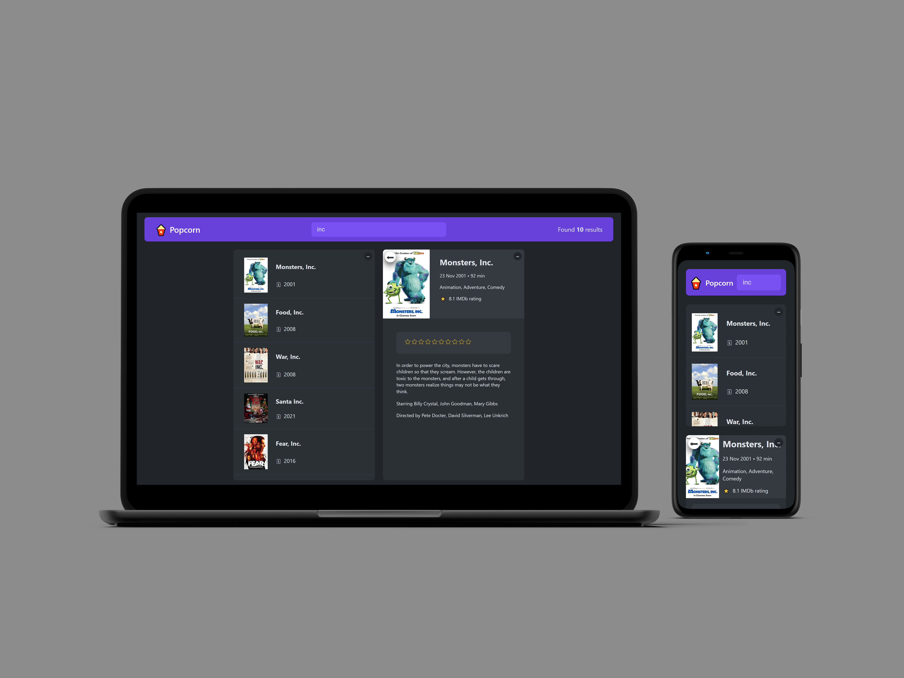

# **Popcorn: Movie Search and Watchlist App**

## **Table of content:**

-   [Description](#description)
-   [Key Features](#key-features)
-   [Technical Highlights](#technical-highlights)
-   [Conclusion](#conclusion)

**Live demo** [click here](https://popcorn-movies-app.netlify.app/)

---

### **Description:**

Popcorn is a React-based movie search and management application that allows users to search for movies, view detailed information, rate them, and manage a watchlist. The app makes use of custom hooks, local storage, and React state to provide a seamless user experience.

---

### **Key Features:**

1. **Movie Search:**

    - Users can search for movies by title.
    - Search results are displayed dynamically as the user types.

2. **Movie Details:**

    - Upon selecting a movie, detailed information is shown, including:
        - **Summary**: A brief description of the movie.
        - **Release Date**: The movie's release date.
        - **Duration**: Runtime of the movie.
        - **IMDB Rating**: The movie’s IMDB score.

3. **Watchlist Management:**

    - Users can add movies to a "Watched" list for future reference.
    - Movies can be removed from the watchlist when desired.

4. **Rating Feature:**
    - Users can rate movies and see their personal ratings along with the IMDB rating.

---

### **Technical Highlights:**

-   **React Features:**

    -   **State Management:** Tracks movie search results, selected movie details, watchlist, and ratings.
    -   **Custom Hooks:** Encapsulates reusable logic, such as fetching movies and managing local storage.

-   **Local Storage Integration:**

    -   Watchlist and ratings are saved persistently, allowing data to persist across sessions.

-   **Responsive Interface:**
    -   Clean and intuitive UI for searching, managing, and viewing movies.

---

### **Conclusion:**

Popcorn is a feature-rich React application that combines efficient state management, custom hooks, and local storage to deliver a functional and user-friendly movie search experience. Its practical features make it a valuable tool for movie enthusiasts and a strong demonstration of your React development skills.
